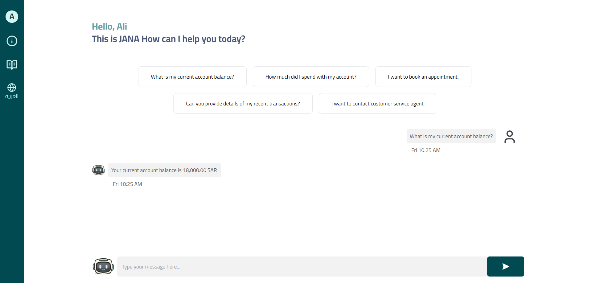
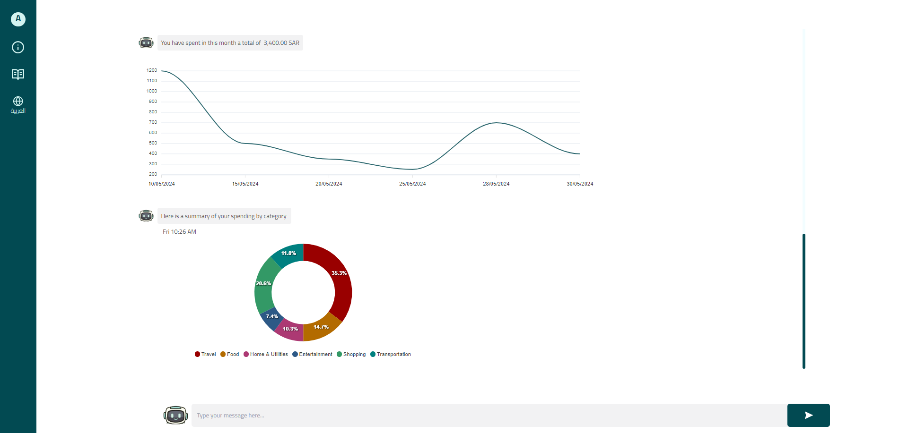
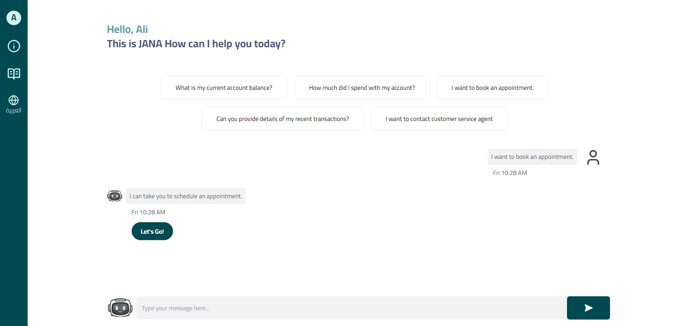
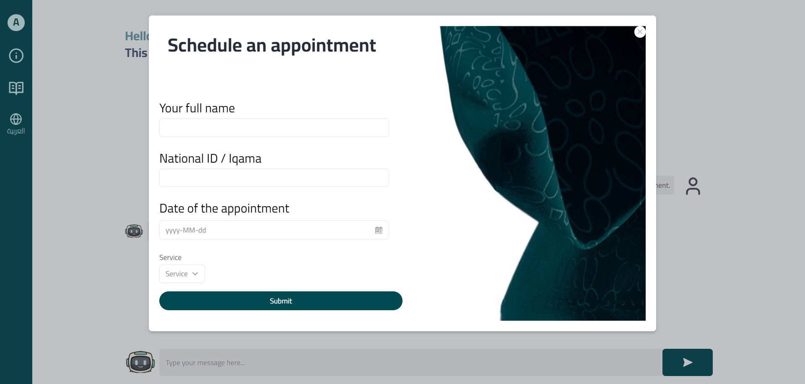
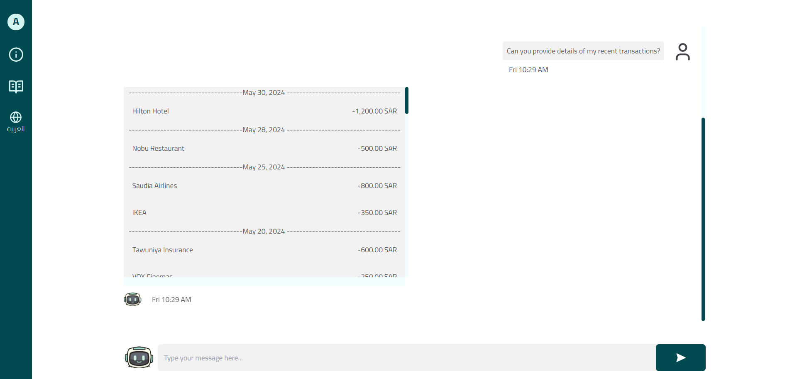
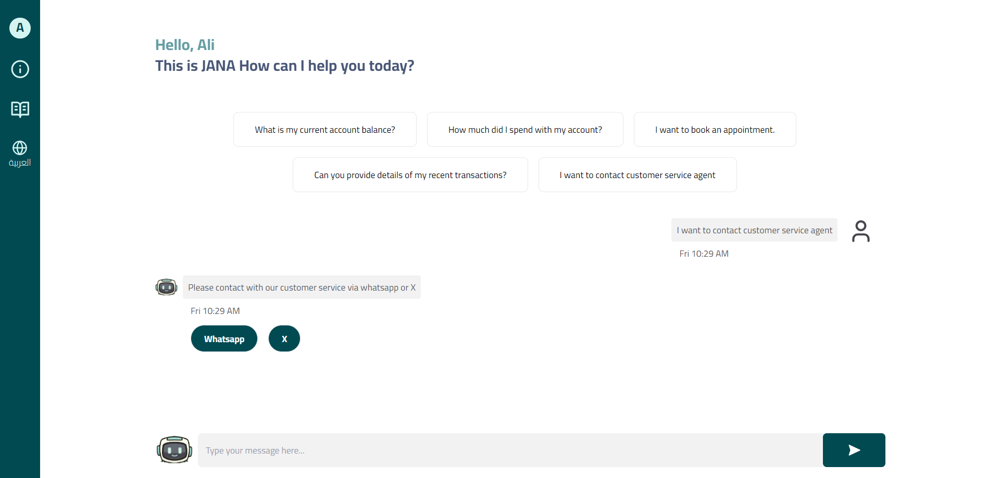

   

   <h2> Jana Virtual Financial Assistant (JVFA) </h2>

## Description
The utilization of Jana Virtual Financial Assistant (JVFA) to transform our customer service services. In response to the growing demand for seamless and efficient customer interactions, this project aims to provide round-the-clock assistance for common inquiries, real-time balance information, and track spending via a web application. The JVFA project is a web application that aims to enhance customer support and satisfaction and streamline financial decision-making.
## Documentation
Access the full documentation for JVFA at [JVFA Documentation](https://jvfa2024.github.io/doc/). Here, you will find detailed guides and explanations of all features, installation processes, and more.

**Team Name:** EagleEyed Squad

**Members:**
- Layan (Frontend Developer)
- Sarah (Database Engineer & Project Manager)
- Shahad (Backend Developer)

## Table of Contents
1. [JVFA's Features](#jvfas-features)
2. [Installation](#installation)
3. [Usage](#usage)

## JVFA's Features
The main features of the JVFA project are designed to enhance user interaction and streamline financial management processes. Here's a breakdown of these features:

### Finding Answers to Banking-Related Questions via the Chatbot

- **Description:** Users can find answers to their common banking-related inquiries by chatting with the JVFA. This feature enables quick and efficient communication, providing users with immediate responses to their questions.

### Balance Information

- **Description:** Users can view their balance information to track their financial transactions, monitor account activity, and ensure their funds are managed effectively. This feature supports better financial oversight and personal finance management.

### Dashboard Summary Statistics for User Spending

- **Description:** Users can view summary statistics for their spending via the JVFA. Total spending is presented in visually informative dashboards, making it easy for users to interpret and analyze their financial habits.

### Category for My Spending

- **Description:** This feature allows users to view their spending within each category, offering insights into where their money is spent. It helps users manage their budget more effectively by highlighting areas of significant expenditure.

### Book an Appointment

- **Description:** Users can be transferred to the form to book an appointment to visit a bank branch through the chatbot. This simplifies the process of scheduling meetings with bank representatives, enhancing customer service and accessibility.

These features collectively aim to provide a comprehensive and user-friendly financial management tool, making banking simpler and more interactive for all users.

## Installation

## Usage
JVFA provides a variety of features to enhance your financial management experience. Below are some common usage examples:

### Finding Answers to Banking-Related Questions

To get quick answers about banking queries such as interest rates, loan policies, or branch locations:
- **Chatbot Interaction**: 

### Checking Balance Information

You can easily check your account balance at any time:
- **Account Balance**: 

### Viewing Dashboard Summary Statistics

For a quick overview of your financial status:
- **Dashboard View**: 
- **Dashboard View**: 

### Booking an Appointment
To schedule an appointment with a customer service agent:
- **Book an Appointment**: 
- **Book an Appointment**: 

### Viewing Latest Transactions
To review your recent financial activities:
- **Transaction List**: 

### Contact Customer Service Agent
If you need personalized assistance or have specific inquiries:
- **Contact Support**: 
